# Container Sequences
* Can hold items of diff types, including nested containers.
  * e.g. list, tuple, collections.deque
* holds references to the object it contains
# Flat Sequences
* hold items of one simple type
  * e.g. str, bytes, array.array
* stores the value of its contents in its own memory space
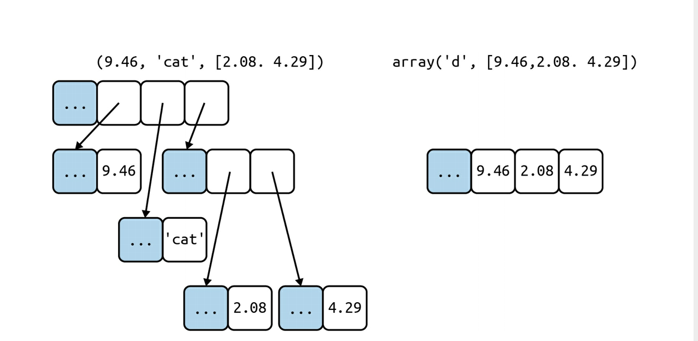

Every Python object in memory has a header with metadata. 
* float example.
  * ob_refcnt: reference count
  * ob_type: pointed to obj type
  * ob_fval: a C double holding val of float

# Mutable Sequences:
* list, bytearray,array.array, collections.deque

# Immutable Sequences:
* tuple, str, bytes

# List Comprehensions (listcomps):
* TIP: can assign variables with := operator
  * `codes = [last := ord(c) for c in x]`
  * otherwise vars are just locally scoped

* Cartesian Product
  * 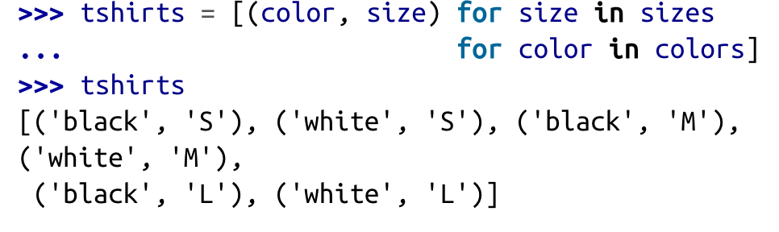

# Generator Expressions (genexp):
* saves memory because it yields items one by one by using he iterator protocol instead of building a whole list just to feed another constructor
* same syntax as listcomps but `()` instead of `[]`
* 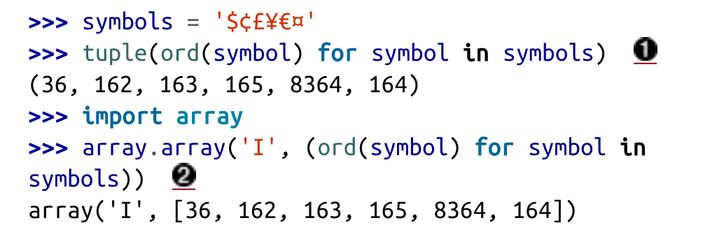

# Tuples
Not only immutable lists! Can also be used as records with no field names.
* e.g. with tuple unpacking:
  * `city, year, pop, chg, area = ('Tokyo', 2003, 32_450, 0.66, 8014)`
* 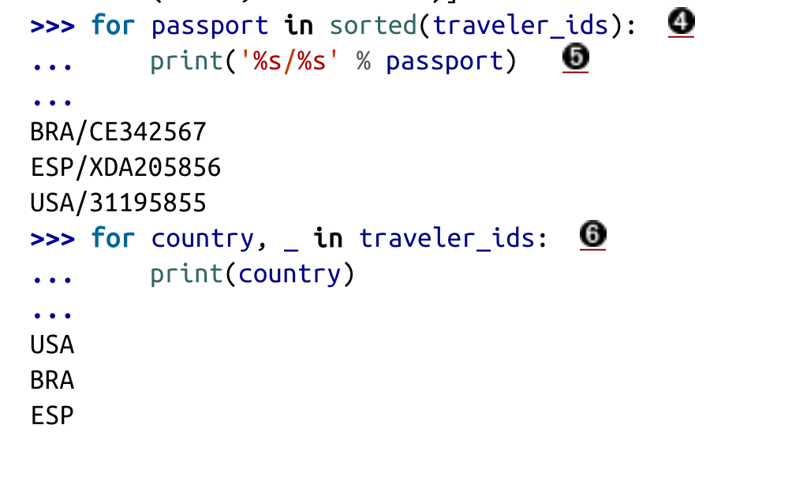
* Optimization:
  * Use less memory than a list and allows Python to do some optimizations.
    * object values of references within a tuple can be changed, however. Only references are static.
  * Given a tuple t, tuple(t) simply returns a reference to the same t. There’s no need to copy. In contrast,
    given a list l, the list(l) constructor must create a new copy of l.
  * Because of its fixed length, a tuple instance is allocated the exact memory space it needs.
    * lists are allocated with room to spare so they can expand.
    * references to items in tuple are stored in an array in the tuple struct
    * list holds a pointer to an array of references (will reallocate the array of references as it grows)
* Methods
  * lacks reversed, adding, removing methods

# Iterable Unpacking
Parallel Assignment is most common
* 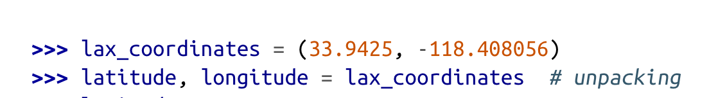
* can swap in one line w/ unpacking
  * `b, a = a, b`
* \* prefix
  * Unpacking example: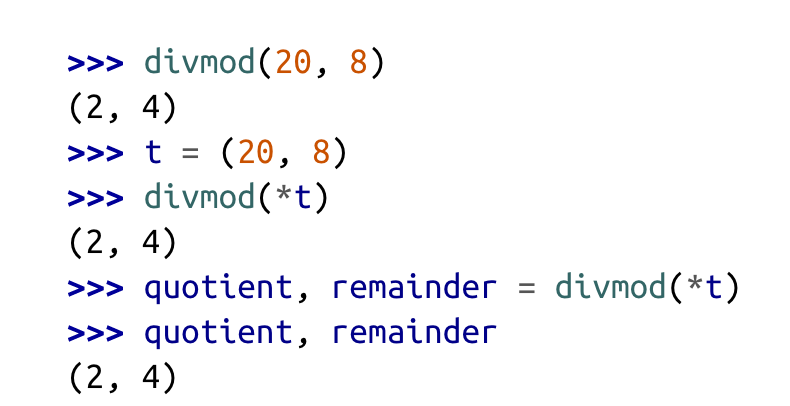
  * can also grab excess items
    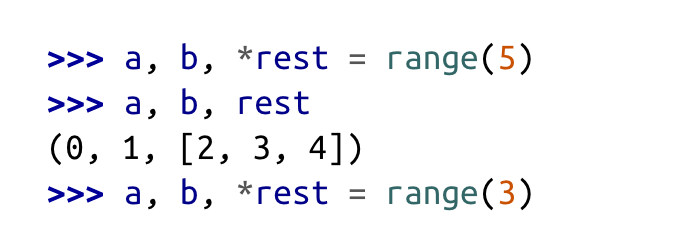
    * can appear in any position!
    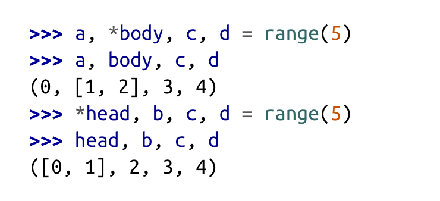
  * useful for defining sequences:
  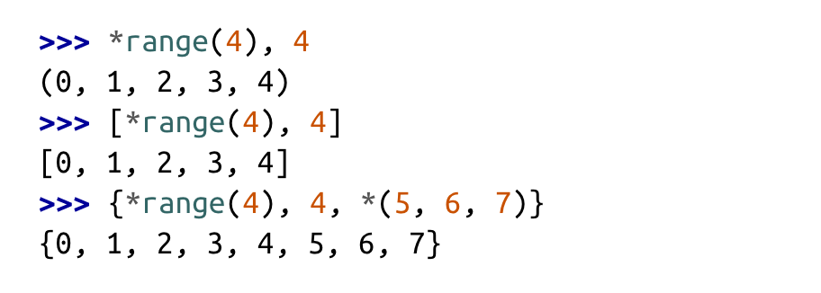

Nested Unpacking
* (a, b, (c, d))
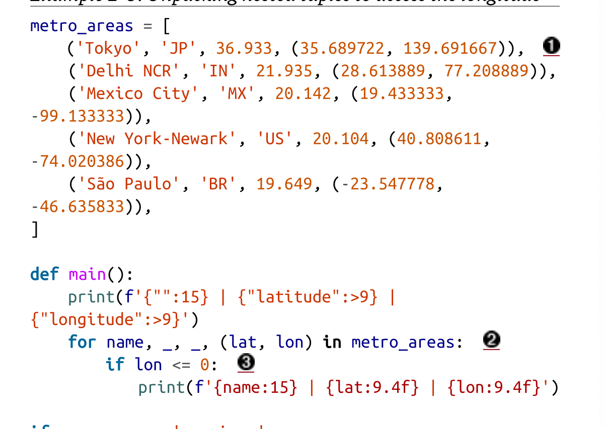

# Pattern Matching with Sequences
New in 3.10, match/case statement
  * works with list, tuple. array.array, range, memoryview, collections.deque
  * Can handle commands like `['BEEPER', 440, 3]`
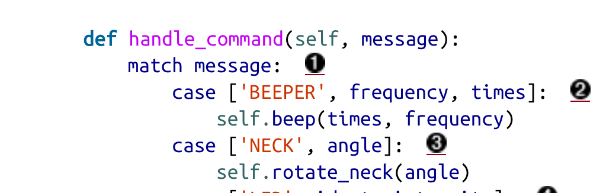
  * Similar to switch/case but improved:
    * destructuring - a more advanced form of unpacking (in Scala too)
    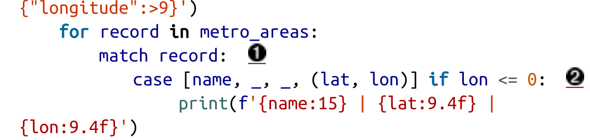
    * str, bytes, bytearray are NOT handled as sequences with match/case
      * treated as atomic value
        * have to convert like this:
        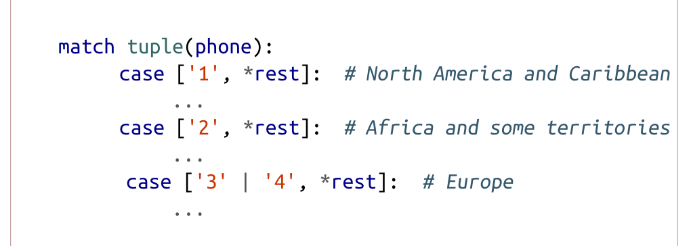
    * _ symbol never bound to value and can appear more than once
    * can even pattern match for type
      * `case [str(name), _, _, (float(lat), float(lon))]:`
    * wildcard for any num fields between patterns: `*_,`
      * `case [str(name), *_, (float(lat), float(lon))]:`
      * `*extra` binds them to a list
  
# Slicing
s[a:b:c] step c can skip items, or reverse w/ -1
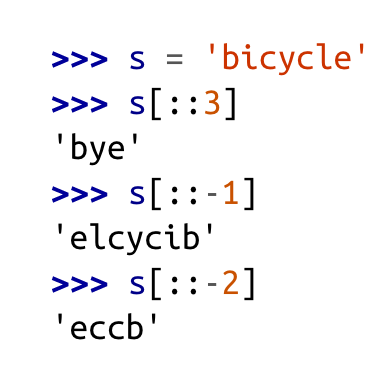

Alternate syntax `foo = slice(0,2)`

We can delete with slices:
  * `del l[0:2]`
We can modify arrays with:
  * ```
    l = [0,1,2] 
    l[0:3] = [100]
    l = [100]
    ```®
  
# + * operators with sequences
\* operator
* `['_'] * 3 = ['_', '_', '_']`
  * e.g. 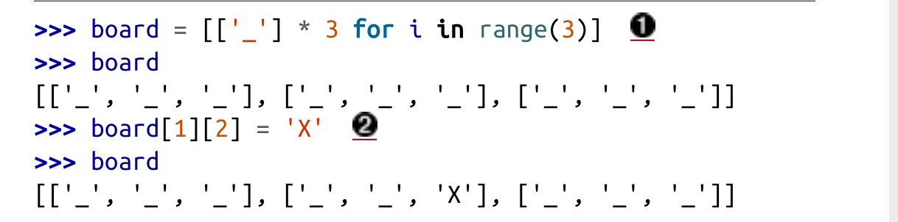

\+ op
* appends lists
```
    >>>lst1=[12, 34, 56]
    >>>lst2=[78, 90]
    >>>print(lst1+lst2)
    [12, 34, 56, 78, 90]
  ```

# Built in Sorting
`list.sort()` returns `None` to remind us that it changes the receiver and does not create a new list.
* this should be the convention for funcs that change an object in place
  * return `None`
  * one drawback is cannot cascade calls w/ None return
`sorted` created a new list and returns it
  * accepts any iterable
  
BOTH have these arguments:
* reverse
  * True is descending order (3,2,1)
* key
  * applied to each item to produce its sorting key
  * e.g. sorting a list of strings... `key=str.lower` performs case-insensitive sort, `key=len` sorts by char length

NOTE: python sorts strings lexicographically by character code. 
So ASCII uppercase come become lowercase and non-ASCII chars are not really sorted.

# Alternatives to Lists and Tuples
`array` saves a lot of memory compared to a list when handling millions of floating point values.

`deque` (doubled ended queue) is more efficient FIFO structure if adding and
removing items from opposite ends of a list.

if your code often checks for inclusion `item in collection` consider using a `set` 
* optimized for membership checking and iterable
* but NOT sequences because no ordering (more in ch 3)

# Arrays
`array.array` is great for lists that only contain numbers
* as lean as a C array! 
* you provide a typecode (a litter to determine underlying C type)
  * e.g. `array('b') is a signed char: int from -128 to 127, each item stored in a single byte as an int
  * `array('d')` for floating point (double precision)
    * can save to binary file `.tofile(fp)`, load w/ `.fromfile(fp)`
    * 60x faster than reading from text file!!
* no longer has inplace sort in python 3.10
  * use built in sorted `a = array.array(a.typecode, sorted(a))`
  * to keep sorted while adding items use `bisect.insort`

# Memory Views
Shared-memory sequence type that lets you handle slices of arrays without copying bytes.
* Inspired by NumPy library
* "A memoryview is essentially a generalized NumPy array structure in Python 
* itself (without the math). It allows you to share memory between data-structures
* (things like PIL images, SQLite databases, NumPy arrays, etc.) without first
* copying. This is very important for large data sets."
* "Example 2-20. Handling 6 bytes of memory as 1×6, 2×3, and 3×2 views"
  * 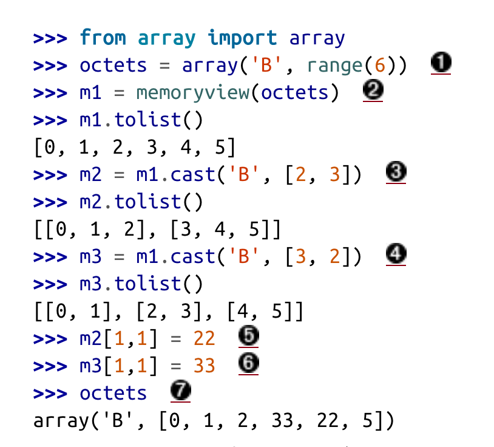

# NumPy and Deques!
To Be continued!
