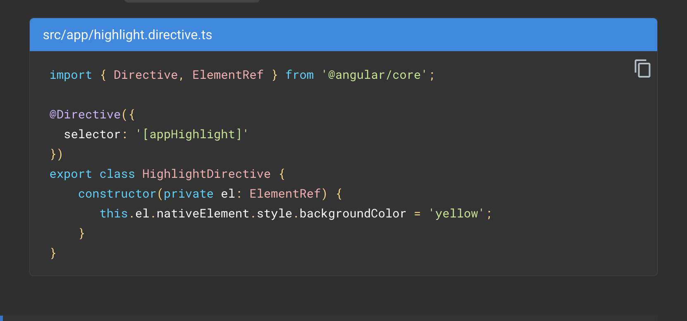
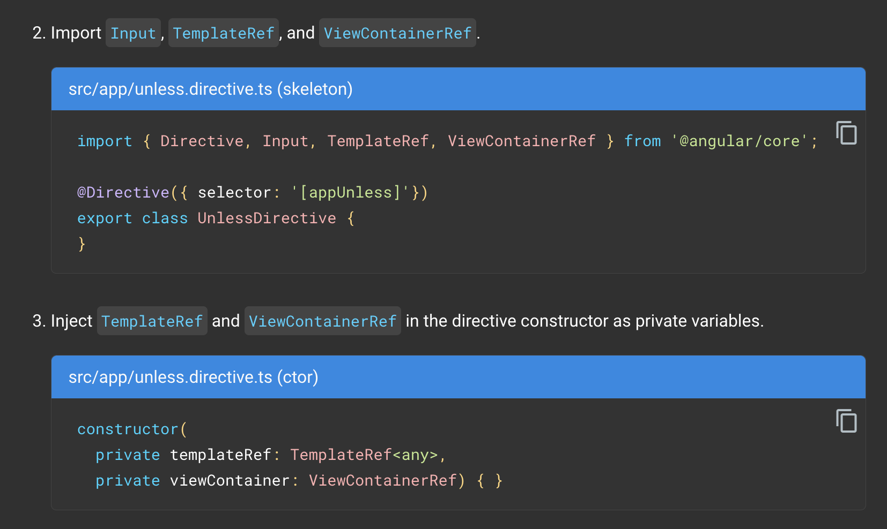
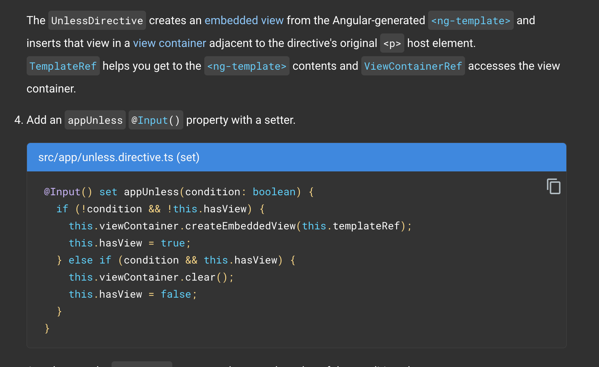
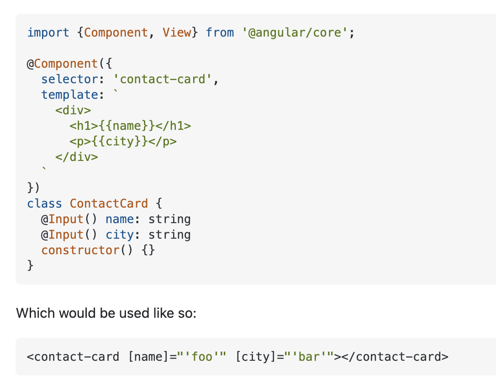
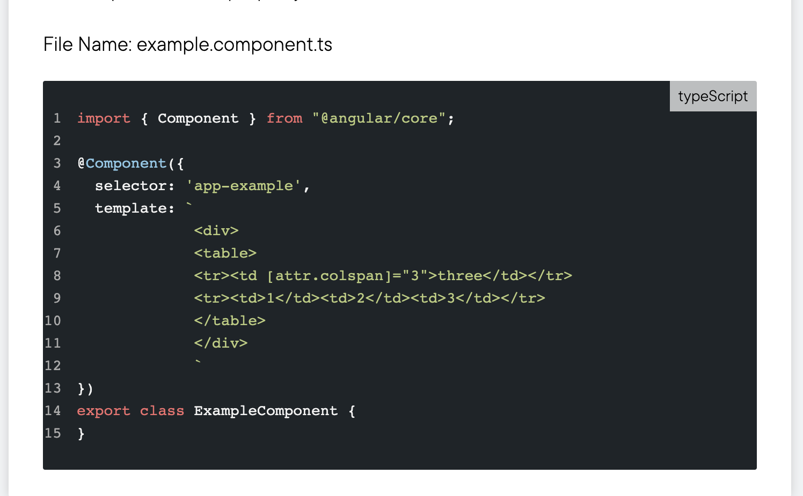
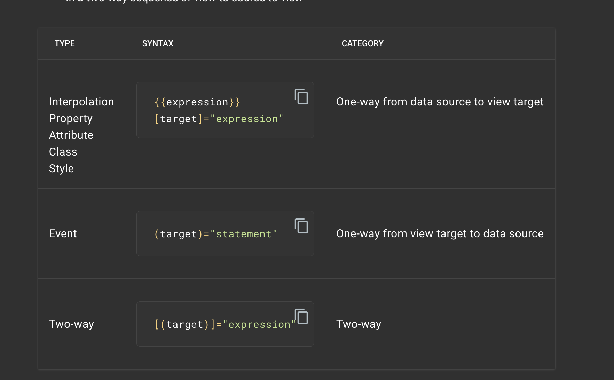

# Directive vs Component:

**Directives** add behaviour to an existing DOM element or an existing component instance. 
One example use case for a directive would be to log a click on an element.

https://stackoverflow.com/questions/32680244/directive-vs-component-in-angular

Two types: Attribute and Structural
- **Attribute**
    - Change the appearance or behavior of DOM elements and Angular components with attribute directives.
    - ```ng generate directive highlight```
    - 
    - ```<p appHighlight>Highlight me!</p>```

- **Structural**
    - Angular provides a set of built-in structural directives (such as NgIf, NgForOf, NgSwitch and others) which are commonly used in all Angular projects.
    - ```ng generate directive unless```
    - 
    - 
    - Angular's <ng-template> element defines a template that is not rendered by default.
    - more: https://angular.io/guide/structural-directives


**Components** A component, rather than adding/modifying behaviour, actually 
creates its own view (hierarchy of DOM elements) with attached behaviour. 
An example use case for this might be a contact card component:


# Data Binding 
- Interpolation
  - One way binding with ```{{foo}}```
  - Template Statements
    - methods or properties that you can use in your HTML to respond to user events
    - e.g. ```<button type="button" (click)="deleteHero()">Delete hero</button>```
  - Binding to variable state
    - ```<!-- Bind button disabled state to `isUnchanged` property -->
    <button type="button" [disabled]="isUnchanged">Save</button>```
    - NOTE: can also bind to attributes. Attribute binding is mainly useful where we don’t have any property view with respect to an HTML element attribute.
    - 
  - Types of Data Binding
    - 
    - The binding punctuation of [], (), [()], and the prefix specify the direction of data flow.
      - Use [] to bind from source to view 
      - Use () to bind from view to source 
      - Use [()] to bind in a two-way sequence of view to source to view```
    - Two-way binding gives components in your application a way to share data. Use two-way binding to listen for events and update values simultaneously between parent and child components.
    - Two-way binding syntax is shorthand for a combination of property binding and event binding. The SizerComponent binding as separate property binding and event binding is as follows.
      - ```<app-sizer [size]="fontSizePx" (sizeChange)="fontSizePx=$event"></app-sizer>```
      - shorthand ```<app-sizer [(size)]="fontSizePx"></app-sizer>```
      - https://angular.io/guide/two-way-binding
