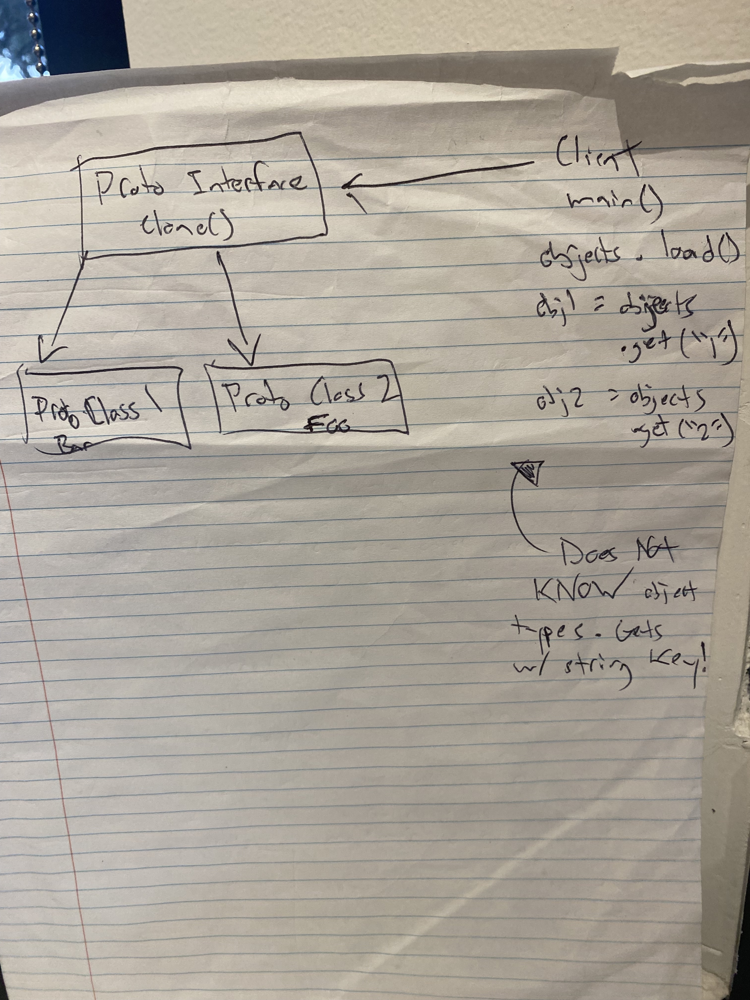

# Singleton
* only allows one object to be created

# Prototype
* Concept: creates a shared subclass for working with 3rd party code 
  AND creates new objects without knowing type.
  * Happens with 3rd party code when objects passed via some interface. 
    Concrete classes are **unknown**.
    * Allows 3d party code to not need the object types are used with the app.
  * Provides client code with general interface for working with all 
    objects that support cloning. Makes client independent of concrete
    classes of objects it clones.
* clones an object (like mitosis)
* aim is to reduce # of clases used for an application
* highly recommended when object creation is **expensive**
* can copy an object without knowing its type
* 