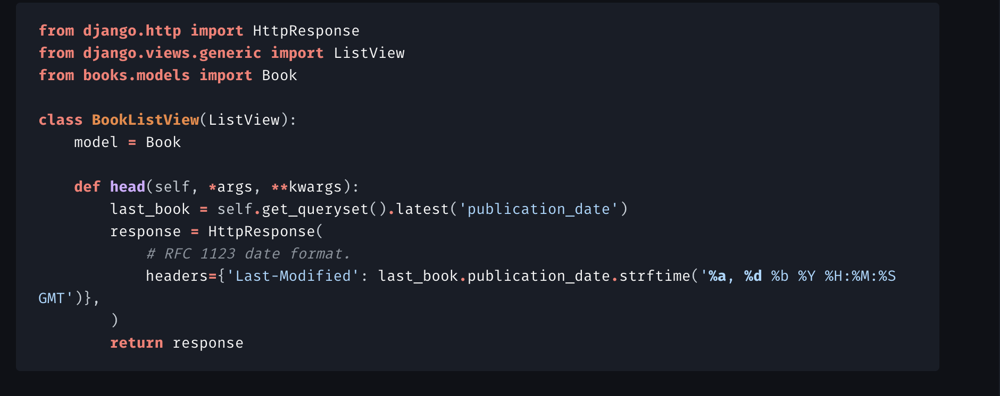
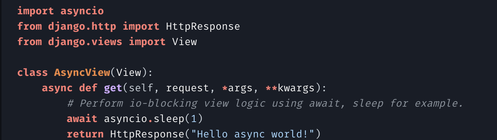

# Setup
```$ django-admin startproject mysite```

project structure:
```
mysite/
    manage.py
    mysite/
        __init__.py
        settings.py
        urls.py
        asgi.py
        wsgi.py
```

- A Django settings file contains all the configuration of your Django installation.
    - start server w/ settings 
      - `django-admin runserver --settings=mysite.settings`
    - on live server
      - ```os.environ['DJANGO_SETTINGS_MODULE'] = 'mysite.settings'```
    - list of settings https://docs.djangoproject.com/en/4.1/ref/settings/

- `manage.py` A command-line utility that lets you interact with this Django project in various ways and sets the DJANGO_SETTINGS_MODULE environment variable so that it points to your project’s settings.py file.
  - https://docs.djangoproject.com/en/4.1/ref/django-admin/
- `python manage.py runserver`

# Creating a View


In `urls.py`write something like this:
```
from django.urls import path
from . import views

urlpatterns = [
   # ex: /polls/
    path('', views.index, name='index'),
    path('polls/', include('polls.urls')),
    path('admin/', admin.site.urls),
]
```
- The include() function allows referencing other URLconfs. Whenever Django encounters include(), 
 it chops off whatever part of the URL matched up to that point and sends the remaining string
 to the included URLconf for further processing.
 
- The idea behind include() is to make it easy to plug-and-play URLs. Since polls are in 
 their own URLconf (polls/urls.py), they can be placed under “/polls/”, or under “/fun_polls/”,
 or under “/content/polls/”, or any other path root, and the app will still work.

  - *NOTE: You should always use include() when you include other URL patterns. admin.site.urls is the only exception to this.


- More advanced url patterns:
  - ```
    urlpatterns = [
    # ex: /polls/
    path('', views.index, name='index'),
    path('polls/', include('polls.urls')),
    path('admin/', admin.site.urls),
    
    # MORE ADVANCED PATTERNS
    # ex: /polls/5/
    path('<int:question_id>/', views.detail, name='detail'),
    # ex: /polls/5/results/
    path('<int:question_id>/results/', views.results, name='results'),
    # ex: /polls/5/vote/
    path('<int:question_id>/vote/', views.vote, name='vote'),
    ]
    ```
  - For a view like...
  ```
  def detail(request, question_id):
    return HttpResponse("You're looking at question %s." % question_id)

  def results(request, question_id):
    response = "You're looking at the results of question %s."
    return HttpResponse(response % question_id)
    
  def vote(request, question_id):
    return HttpResponse("You're voting on question %s." % question_id)
  ```
**Class Based Views**
- Here we can attach models to a view endpoint and have different behaviors depending
 on the request type (GET , HEAD, wtc)

- ```
    urlpatterns = [
    path('books/', BookListView.as_view()),
    ]
    ```
- ListView is a base class for a page representing a list of objects.
- We can also make asyc views

- https://docs.djangoproject.com/en/4.1/topics/class-based-views/

# DB and migrations
- ` python manage.py migrate`
- Can create DB models in similar ways to other frameworks like SQL Alchemy
  - ```
    from django.db import models
  
    class Question(models.Model):
        question = models.ForeignKey(Question, on_delete=models.CASCADE)
        choice_text = models.CharField(max_length=200)
        votes = models.IntegerField(default=0)
    ```
    -`python manage.py makemigrations foo` makes a new migration for changed models

# Interactive Shell
- `python manage.py shell`
- Interact with models and data:
  - ```
    >>> from polls.models import Choice, Question  # Import the model classes we just wrote.

    # No questions are in the system yet.
    >>> Question.objects.all()
    >>> Question.objects.filter(id=1)
    ```