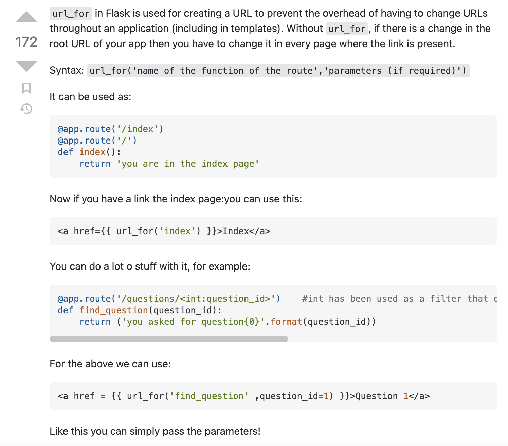

# WSGI
The Web Server Gateway Interface is a simple calling convention for web servers to forward
requests to web applications or frameworks written in the Python programming language.

# Contexts
`from flask import request`

The request context keeps track of the request-level data during a request. Rather than passing
the request object to each function that runs during a request, the request and session proxies are accessed instead.

This is similar to The Application Context, which keeps track of the application-level data independent of a request.
A corresponding application context is pushed when a request context is pushed.

The Flask.wsgi_app() method is called to handle each request. It manages the contexts during the request. 
Internally, the request and application contexts work like stacks. When contexts are pushed, the proxies 
that depend on them are available and point at information from the top item.

When the request starts, a RequestContext is created and pushed, which creates and pushes an AppContext first if
a context for that application is not already the top context. While these contexts are pushed, the current_app,
g, request, and session proxies are available to the original thread handling the request.
* `flask.g`: A namespace object that can store data during an application context
  * This is a good place to store resources during a request. For example, a before_request function could
    load a user object from a session id, then set g.user to be used in the view function.

Other contexts may be pushed to change the proxies during a request. While this is not a common pattern, 
it can be used in advanced applications to, for example, do internal redirects or chain different applications together.

After the request is dispatched and a response is generated and sent, the request context is popped, 
which then pops the application context. Immediately before they are popped, the teardown_request() 
and teardown_appcontext() functions are executed. These execute even if an unhandled exception occurred during dispatch.

https://flask.palletsprojects.com/en/2.2.x/reqcontext/

# url_for
`from flask import url_for`
* 
https://stackoverflow.com/questions/7478366/create-dynamic-urls-in-flask-with-url-for

# Local Context
local = Local() 
* Resolves to thread specific data for a request
* local.first_name = "foo"

# Request Context
Allows for internal redirects. Pushes request B on top of the 
stack and allows req A to return B's response. 

Request context is one item of "request context stack".
Similar to "app_context" and "app context stack"

Flask can have multiple apps.

# Multiprocessing

* gunicorn, gevent
* greenlets: lightweight coroutines for in-process sequential concurrent programming.
  * cooperative and sequential
  * greenlets can be used on their own, but they are frequently used with frameworks such as gevent to provide higher-level abstractions and asynchronous I/O.
  * thread(greenlet): get with `get_ident()`
  * https://greenlet.readthedocs.io/en/latest/
* Threads are truly parallel.
  * Threads (in theory) are preemptive and parallel [1], meaning that multiple threads can be processing work at the same time.
* gevent is an example of using greenlets to integrate with IO event loops (libev and libuv) to provide a complete asynchronous environment using familiar programming patterns.

https://github.com/iximiuz/flask-gevent-tutorial
