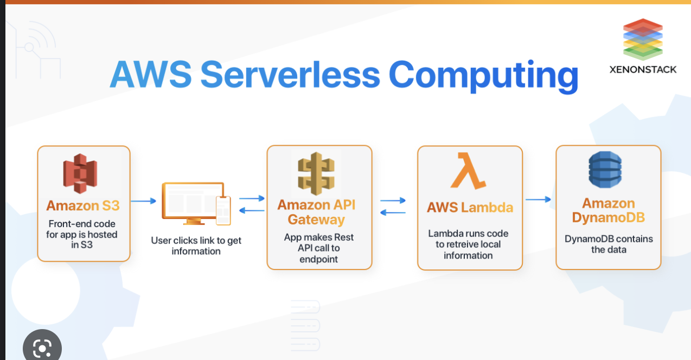
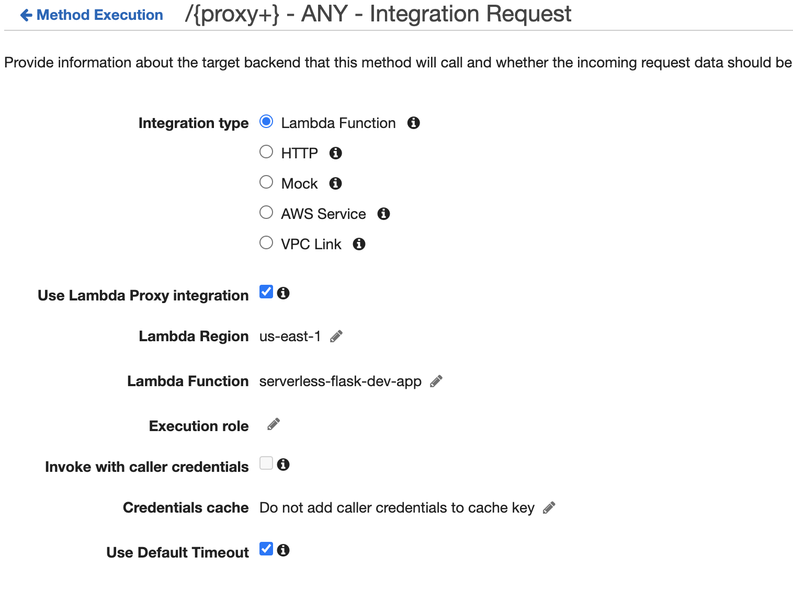

# AWS Architecture

API Gateway routes traffic with a Lambda Proxy to Lambda
* Amazon API Gateway Lambda proxy integration is a simple, powerful, and nimble mechanism to build an API with a setup of a single API method
  * The Lambda proxy integration allows the client to call a single Lambda function in the backend. 
    The function accesses many resources or features of other AWS services, including calling other Lambda functions.
  * In Lambda proxy integration, when a client submits an API request, API Gateway passes to the integrated Lambda 
    function the raw request as-is, except that the order of the request parameters is not preserved.
  * ANY /{proxy+}: The client must choose a particular HTTP method, must set a particular resource path hierarchy,
    and can set any headers, query string parameters, and applicable payload to pass the data as input to the integrated Lambda function.
  * ANY /res: The client must choose a particular HTTP method and can set any headers, query string parameters,
    and applicable payload to pass the data as input to the integrated Lambda function.
  * GET|POST|PUT|... /{proxy+}: The client can set a particular resource path hierarchy, any headers, query string parameters,
    and applicable payload to pass the data as input to the integrated Lambda function.
  * GET|POST|PUT|... /res/{path}/...: The client must choose a particular path segment (for the {path} variable) 
    and can set any request headers, query string parameters, and applicable payload to pass input data to the integrated Lambda function.

https://docs.aws.amazon.com/apigateway/latest/developerguide/set-up-lambda-proxy-integrations.html

- You can add an authorizer here if you want.
  - Can accept a JWT, API Key, etc.
- Now have to give the lambda permissions to access other services like S3, RDS, etc
