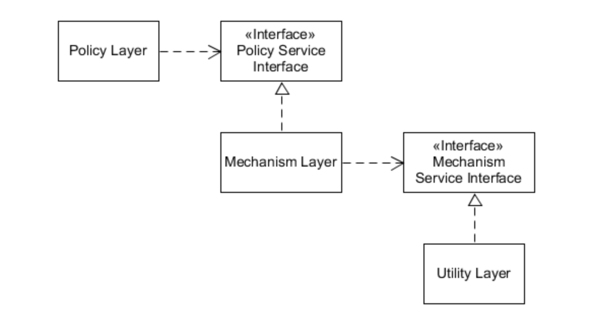

# Databases

* How do you scale up a Postgres db?
  * scale up (more mem, cpu) - vertical
  * scale-out (more instances) - horizontal
    * other instances provide reads but writes are bottle-necked by main server
    * hard for writes (sharding can help)

* Caching:
  * memcached
  * redis
  * cassandra
  * CDNs
  * S3

* NoSQL
  * can scale pretty easily

# IOC Pattern
* loosely couples classes (e.g. use a factory) basically creates interfaces to decouples

# Dependency Inversion Principle
* Traditional Layers Pattern
* 
* With DIP, loosely couples. High level doesn't depend on the low level, depends on abstractions
* Abstractions don't depend on details, details depend on abstractions
* 